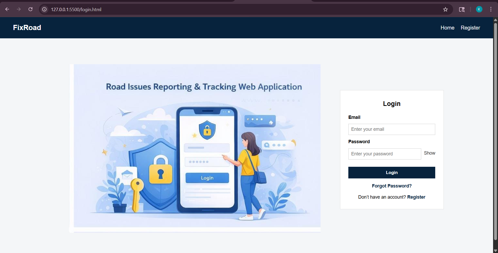
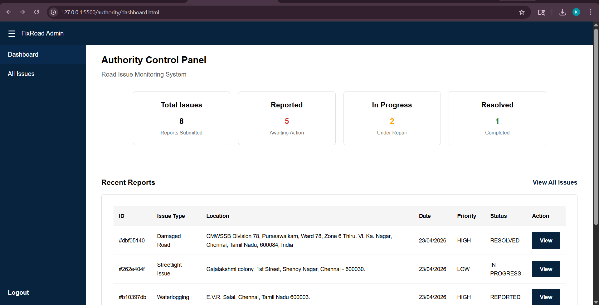

#  FixRoad – Road Issues Reporting and Tracking System

FixRoad is a full-stack web application designed to simplify how road-related issues are reported and managed. 
It enables citizens to report problems such as potholes, waterlogging, 
and damaged roads using GPS-based location, while providing authorities with a centralized system 
to track, prioritize, and resolve them efficiently.
With features like intelligent duplicate detection, priority-based handling, and real-time status tracking, 
FixRoad ensures faster resolution, better transparency, and improved road maintenance.


##  Key Features

*  GPS Location Detection
*  Duplicate Complaint Detection (Cosine Similarity + Levenshtein Similarity + Location Proximity)
*  Priority Calculation (based on severity, road type, and Upvotes)
*  Status Tracking (Reported → In Progress → Resolved)

##  Tech Stack

**Frontend:** HTML, CSS, JavaScript

**Backend:** Java 17, Spring Boot 3.5.13, Spring Data JPA (Hibernate)

**Database:** PostgreSQL

**APIs & Services:** Google Maps API (GPS & location), Gmail SMTP (Email notifications)

**Build Tool:** Maven

##  Algorithms Used

### Duplicate Detection

The system uses a hybrid approach to detect duplicate complaints by combining:

* Cosine Similarity → compares meaning of title and description
* Levenshtein Similarity → handles spelling and small text differences
* Location Proximity (Haversine Distance) → checks if issues are reported near the same place

A weighted score is calculated from these factors.
- If the score exceeds a threshold (e.g., 75%), the complaint is marked as a duplicate.

### Handling Duplicates

Instead of creating a new complaint, the user is redirected to the existing issue, where they can:
* Upvote the issue
* Support visibility and priority

This reduces duplicate reports and helps authorities focus on high-impact problems.

###  Priority Calculation

Calculates priority based on:

* Severity level
* Road category
* Number of upvotes

Issues are classified into **Low, Medium, High, Critical priority** for efficient resolution.

## Project Structure

### Frontend Structure
```
/Frontend
│
├── /auth
│   ├── login.html
│   ├── register.html
│   ├── otp.html
│   ├── forgot-password.html
│   └── reset-password.html
│
├── /user
│   ├── home.html
│   ├── report-issue.html
│   ├── my-issues.html
│   └── track-status.html
│
├── /admin
│   ├── dashboard.html
│   ├── all-issues.html
│   └── view-issue.html
│
├── /css
│   ├── style.css
│   └── responsive.css
│
├── /js
│   ├── script.js
│   ├── dashboard.js
│   ├── all-issues.js
│   ├── view-issue.js
│   ├── myissues.js
│   ├── trackstatus.js
│   └── reportissue.js
│
├── /images
│   ├── login.jpeg
│   ├── registration.jpeg
│   ├── otp.jpeg
│   ├── road-bg.jpg
│   ├── pothole.jpg
│   ├── streetlight.jpg
│   └── waterlogging.jpg
│
└── index.html

```

### Backend Structure

```
/fixroad
│
├── src/main/java/com/fixroad
│   │
│   ├── config
│   │   ├── DataInitializer.java
│   │   ├── SecurityConfig.java
│   │   └── WebConfig.java
│   │
│   ├── controller
│   │   ├── AuthController.java
│   │   ├── ImageController.java
│   │   ├── IssueController.java
│   │   ├── StatusHistoryController.java
│   │   └── TestController.java
│   │
│   ├── dto
│   │   ├── AssignRepairRequest.java
│   │   ├── CommentRequest.java
│   │   ├── CommentResponse.java
│   │   ├── DuplicateResultDTO.java
│   │   ├── ForgotPasswordRequest.java
│   │   ├── IssueDetailResponse.java
│   │   ├── IssueRequest.java
│   │   ├── IssueResponse.java
│   │   ├── LoginRequest.java
│   │   ├── RegisterRequest.java
│   │   ├── ResetPasswordRequest.java
│   │   ├── UpdateStatusRequest.java
│   │   └── VerifyOtpRequest.java
│   │
│   ├── exception
│   │   ├── DuplicateIssueException.java
│   │   ├── GlobalExceptionHandler.java
│   │   └── ResourceNotFoundException.java
│   │
│   ├── model
│   │   ├── Comment.java
│   │   ├── Issue.java
│   │   ├── IssueImage.java
│   │   ├── IssueStatus.java
│   │   ├── Otp.java
│   │   ├── RoadCategory.java
│   │   ├── Role.java
│   │   ├── StatusHistory.java
│   │   ├── Upvote.java
│   │   └── User.java
│   │
│   ├── repository
│   │   ├── CommentRepository.java
│   │   ├── IssueImageRepository.java
│   │   ├── IssueRepository.java
│   │   ├── OtpRepository.java
│   │   ├── StatusHistoryRepository.java
│   │   ├── UpvoteRepository.java
│   │   └── UserRepository.java
│   │
│   ├── security
│   │   ├── JwtAuthenticationFilter.java
│   │   └── JwtService.java
│   │
│   ├── service
│   │   │
│   │   ├── duplicate
│   │   │   ├── CosineSimilarityEngine.java
│   │   │   ├── DuplicateDetectionService.java
│   │   │   ├── LocationScoringService.java
│   │   │   └── SimilarityEngine.java
│   │   │
│   │   ├── priority
│   │   │   └── PriorityScoringService.java
│   │   │
│   │   ├── status
│   │   │   └── StatusTransitionService.java
│   │   │
│   │   ├── AuthService.java
│   │   ├── EmailService.java
│   │   ├── IssueService.java
│   │   └── StatusHistoryService.java
│   │
│   └── FixroadApplication.java
│
├── src/main/resources
│   ├── static/
│   ├── templates/
│   └── application.properties
│
├── uploads/
├── target/
├── mvnw
├── mvnw.cmd
└── pom.xml

```


## Setup Instructions

### 1. Clone Repository

```
git clone <your-repo-link>
cd FixRoad
```


### 2. Configure Database (PostgreSQL)

Update `application.properties`:

```
spring.datasource.url=jdbc:postgresql://localhost:5432/database_name 
spring.datasource.username=your_username
spring.datasource.password=your_password
```


### 3. Configure Email (SMTP)

```
spring.mail.username=your_email@gmail.com
spring.mail.password=your_app_password
```

---

### 4. Configure JWT

```
jwt.secret=your_secret_key
```


### 5. Google Maps API
Add your API key inside:
- Frontend/user/report-issue.html
  
```html
<script src="https://maps.googleapis.com/maps/api/js?key=YOUR_API_KEY&libraries=places"></script>
```


### 6. Run Backend

```
### 6. Run Backend

## Windows
mvnw.cmd spring-boot:run

## Linux / macOS
./mvnw spring-boot:run
```

### 7. Run Frontend

Open HTML files from  Live Server in VS Code or any other IDE.


## Screenshots








##  Future Improvements

### Reopening Issues with User Feedback
* Allow users to reopen a resolved issue if the problem persists or was not properly fixed.
 Users can provide feedback, images, or comments, ensuring accountability and improving the quality of resolution.
### Repair Team & Workflow Management Module
* Introduce a dedicated module for managing repair teams,
including task assignment, progress tracking, and workload distribution.
This will streamline the repair process by enabling authorities to assign issues
to specific teams, monitor their progress, and maintain
an organized workflow from reporting to resolution.

------------------------------------------------------------------------------------------------------------------------------------------------------------
